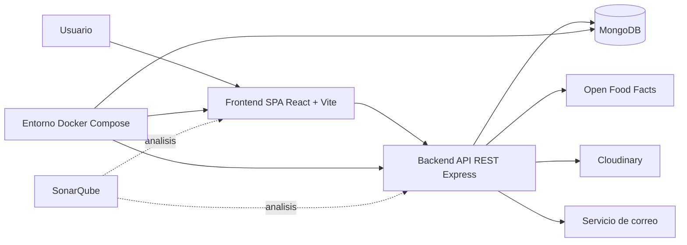
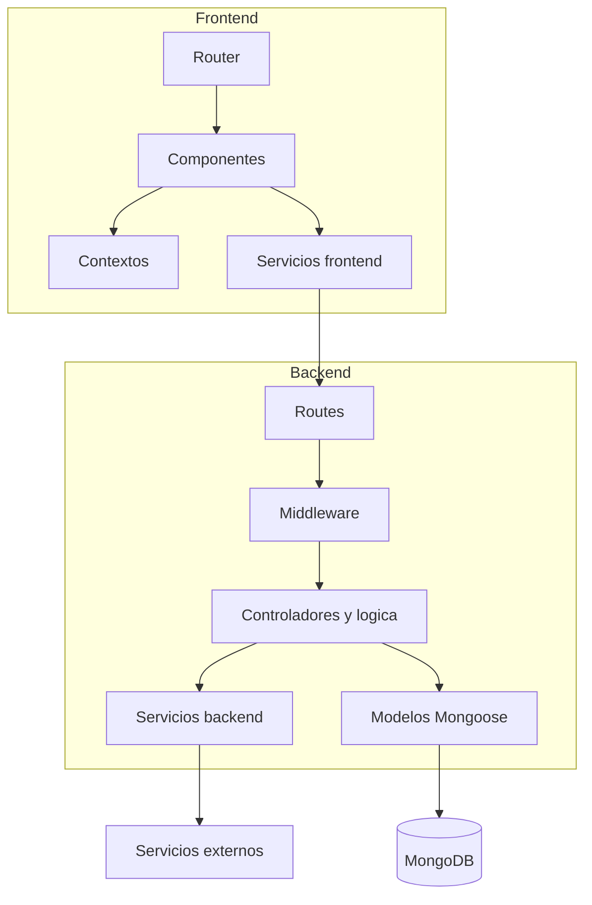
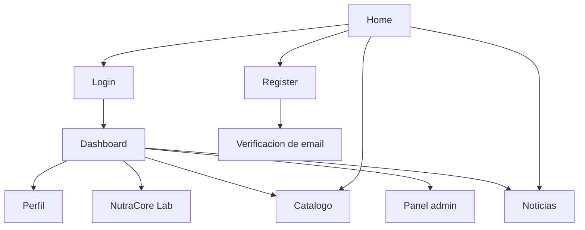
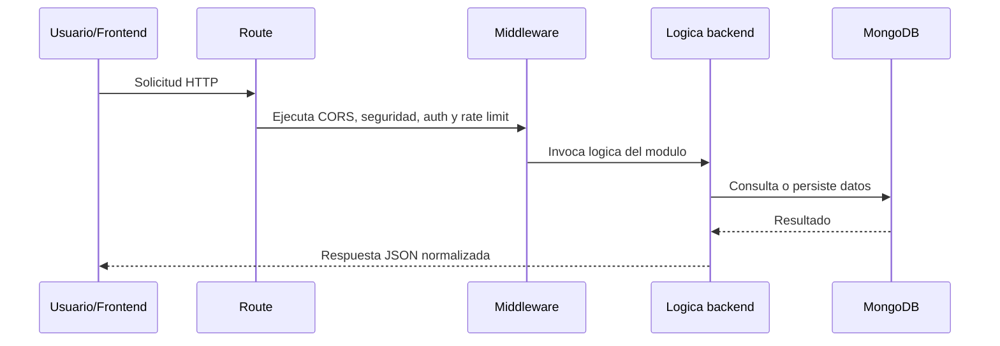
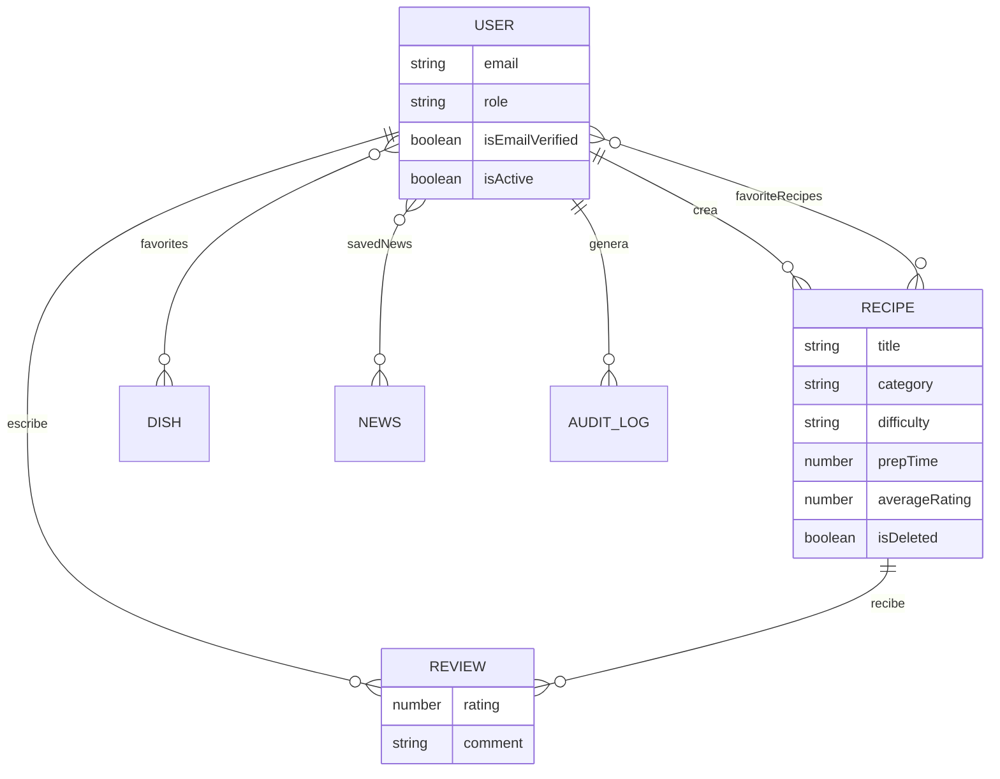
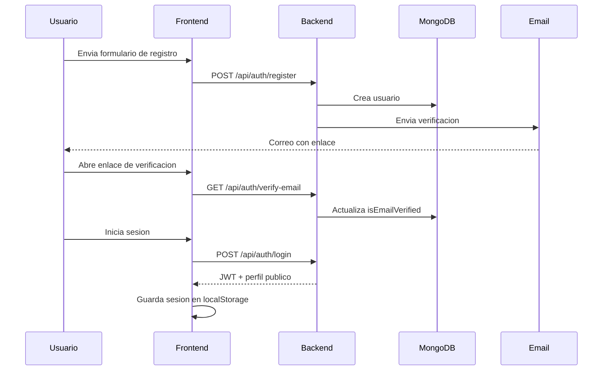
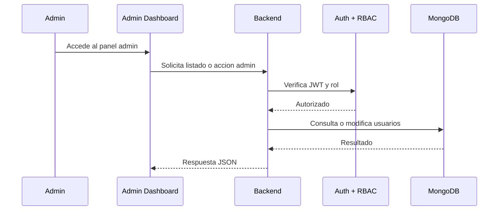
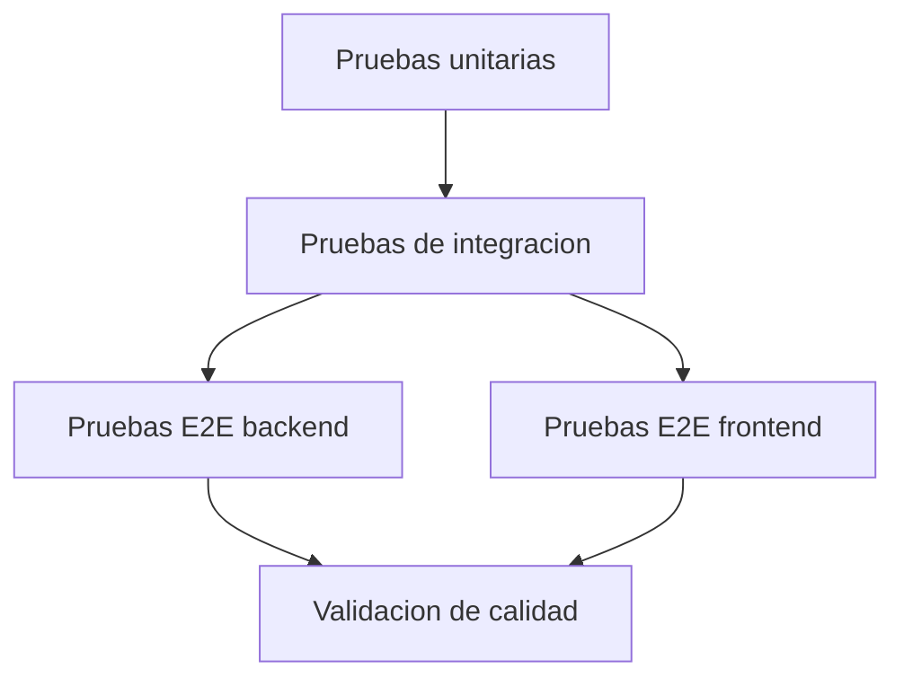
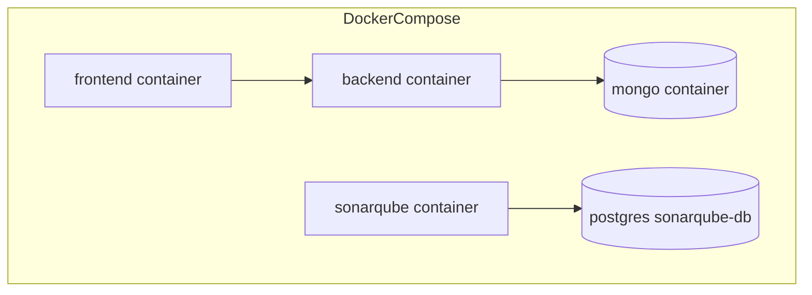

# Memoria Tecnica del TFG - NutraCore

## 1. Portada

- Titulo del proyecto: `NutraCore`
- Autor: `Victor Manuel Ridao Chaves`
- Titulacion: `Grado`
- Asignatura: `Trabajo Fin de Grado`
- Curso academico: `2025-2026`
- Tutor academico: `Ricardo Ruiz Anaya`

## 2. Resumen

NutraCore es una plataforma web full-stack orientada a nutricion, bienestar y planificacion alimentaria. El sistema integra autenticacion segura, gestion de usuarios, catalogo y creacion de recetas, reseñas, noticias especializadas y un panel de administracion. La solucion se ha diseñado siguiendo una arquitectura desacoplada entre frontend y backend, con una API REST desarrollada en Node.js y Express, una interfaz SPA implementada con React y Vite, y persistencia de datos en MongoDB.

Ademas de cubrir necesidades funcionales reales, el proyecto incorpora criterios de calidad propios de un desarrollo profesional: middleware de seguridad, control de acceso por roles, validaciones, documentacion OpenAPI, pruebas automatizadas de varios niveles y opciones de despliegue local y remoto. Todo ello convierte a NutraCore en una propuesta valida tanto desde el punto de vista academico como tecnico.

## 3. Introduccion y justificacion

El proyecto surge de la necesidad de centralizar en una unica aplicacion varias funcionalidades relacionadas con la nutricion y el bienestar personal. Muchas soluciones del mercado fragmentan estas capacidades entre diferentes plataformas: unas se centran en recetas, otras en seguimiento nutricional y otras en contenido divulgativo. NutraCore plantea una alternativa integrada en la que el usuario puede autenticarse, definir objetivos, consultar recetas, crear contenido propio, interactuar con noticias y utilizar herramientas de apoyo para una mejor toma de decisiones alimentarias.

Desde el punto de vista academico, el proyecto permite demostrar competencias en desarrollo frontend, backend, modelado de datos, seguridad, testing, integracion con servicios externos y documentacion de arquitectura.

## 4. Objetivos

### 4.1 Objetivo general

Desarrollar una aplicacion web full-stack para nutricion y gestion de contenido alimentario que sea funcional, mantenible, segura y defendible en un contexto de Trabajo Fin de Grado.

### 4.2 Objetivos especificos

- Implementar un sistema de autenticacion con JWT y verificacion de correo.
- Permitir la gestion de perfiles, objetivos y preferencias nutricionales.
- Ofrecer un catalogo de recetas con filtros, detalle y favoritos.
- Incorporar un laboratorio de recetas para alta y edicion de contenido.
- Mantener un sistema de reseñas asociado a recetas.
- Incluir una seccion de noticias relacionadas con nutricion y habitos saludables.
- Habilitar funciones administrativas para moderacion y gestion del sistema.
- Aplicar pruebas unitarias, de integracion y end-to-end.
- Documentar la API y la arquitectura del sistema.

## 5. Alcance funcional

El alcance implementado en NutraCore cubre los siguientes modulos:

- Autenticacion, registro, login, verificacion de email y cambio de contraseña.
- Perfil de usuario, objetivos nutricionales, preferencias y estadisticas.
- Catalogo de recetas, favoritos y consulta detallada.
- Creacion y edicion de recetas por usuarios autenticados.
- Sistema de reseñas y valoraciones.
- Seccion de noticias con interacciones de guardado, like y compartido.
- Gestion administrativa de usuarios, restauracion y auditoria.
- Consulta de ingredientes y perfiles nutricionales mediante Open Food Facts.

## 6. Arquitectura general del sistema

NutraCore adopta una arquitectura cliente-servidor desacoplada. El frontend funciona como una SPA que consume la API REST expuesta por el backend. Este backend concentra la logica de negocio, la seguridad, la validacion y el acceso a datos. MongoDB actua como sistema de persistencia principal, mientras que servicios externos como Open Food Facts y Cloudinary amplian las capacidades del sistema.

### 6.1 Diagrama general de despliegue



### 6.2 Diagrama de arquitectura logica



## 7. Arquitectura del frontend

El frontend de NutraCore esta desarrollado con React 18 y Vite. Se trata de una SPA que organiza la navegacion con React Router DOM y desacopla la comunicacion con el backend mediante una capa de servicios.

### 7.1 Estructura principal

```text
frontend/
|-- public/
|-- src/
|   |-- components/
|   |-- context/
|   |-- pages/
|   |-- services/
|   |-- config/
|   |-- styles/
|   `-- utils/
`-- tests/e2e/
```

### 7.2 Responsabilidades del frontend

- Gestion de rutas publicas y privadas.
- Persistencia de sesion en `localStorage`.
- Consumo de la API mediante `apiClient`.
- Renderizado de catalogo, perfil, dashboard y vistas administrativas.
- Gestion del estado transversal mediante contextos, especialmente autenticacion, tema y notificaciones.
- Carga diferida de vistas con `lazy` y `Suspense`.

### 7.3 Diagrama de navegacion principal



### 7.4 Proteccion de rutas

Las rutas privadas se encapsulan en el componente `ProtectedRoute`, que comprueba si el usuario esta autenticado y, en caso necesario, si dispone del rol adecuado. Este enfoque permite separar la logica de autorizacion de la definicion de vistas y mejora la mantenibilidad del sistema.

## 8. Arquitectura del backend

El backend se ha construido con Node.js y Express siguiendo una estructura modular. Cada area funcional dispone de sus propias rutas, mientras que los middlewares transversales centralizan la seguridad, la autenticacion, la limitacion de peticiones y la validacion.

### 8.1 Estructura principal

```text
backend/
|-- app.js
|-- server.js
|-- config/
|-- controllers/
|-- middleware/
|-- models/
|-- routes/
|-- services/
|-- docs/
|-- scripts/
`-- tests/
```

### 8.2 Modulos del backend

- `auth`: registro, login, verificacion de email y sesion.
- `users`: perfil, objetivos, preferencias, estadisticas y gestion admin.
- `recipes`: CRUD, favoritos, soft-delete y restauracion.
- `reviews`: valoraciones ligadas a recetas.
- `news`: consulta e interaccion con noticias.
- `dishes`: catalogo complementario de platos.
- `ingredients`: consulta externa y perfil nutricional.
- `docs`: publicacion de Swagger y OpenAPI.

### 8.3 Middlewares y seguridad

El backend incorpora varias capas de proteccion:

- `helmet` para cabeceras HTTP seguras.
- `cors` con lista de origenes permitidos.
- `express-mongo-sanitize` para reducir riesgos de inyeccion sobre consultas NoSQL.
- `hpp` para evitar contaminacion de parametros HTTP.
- limitacion de peticiones con `rateLimiter`.
- autenticacion basada en JWT.
- control de roles y autorizacion para funciones administrativas.

### 8.4 Flujo de peticion en backend



## 9. Modelo de datos

MongoDB se utiliza como base de datos documental principal. Los modelos se implementan con Mongoose y representan las entidades nucleares del sistema.

### 9.1 Entidades principales

- `User`
- `Recipe`
- `Review`
- `News`
- `Dish`
- `AuditLog`
- `MenuConsumption`

### 9.2 Relaciones principales



### 9.3 Consideraciones del modelo

El modelo `User` incluye datos de perfil, objetivos, preferencias, favoritos y estado de activacion. El modelo `Recipe` concentra metadatos de la receta, ingredientes, pasos, informacion nutricional, popularidad y soft-delete. `Review` actua como entidad de relacion entre usuario y receta, incorporando una restriccion de unicidad para impedir multiples reseñas del mismo usuario sobre una misma receta.

## 10. Flujos funcionales relevantes

### 10.1 Flujo de autenticacion



### 10.2 Flujo de creacion de receta

```mermaid
sequenceDiagram
    participant U as Usuario autenticado
    participant FE as NutraCore Lab
    participant API as Backend
    participant OFF as Open Food Facts
    participant DB as MongoDB

    U->>FE: Introduce ingredientes y datos
    FE->>API: GET /api/ingredients/search
    API->>OFF: Consulta ingredientes
    OFF-->>API: Coincidencias
    API-->>FE: Ingredientes sugeridos
    FE->>API: GET /api/ingredients/profile
    API->>OFF: Consulta productos y macros
    OFF-->>API: Datos nutricionales
    API-->>FE: Perfil nutricional promedio
    U->>FE: Confirma receta
    FE->>API: POST /api/recipes
    API->>DB: Guarda receta
    DB-->>API: Receta persistida
    API-->>FE: Respuesta de exito
```

### 10.3 Flujo de administracion



## 11. Integraciones externas

### 11.1 Open Food Facts

El modulo de ingredientes utiliza Open Food Facts como fuente externa para enriquecer el sistema con busquedas de ingredientes y perfiles nutricionales aproximados. La implementacion incluye:

- carga remota de taxonomias de ingredientes;
- normalizacion textual y tolerancia a errores tipograficos;
- cache temporal en memoria para reducir llamadas repetidas;
- calculo de promedios nutricionales sobre muestras de productos;
- perfiles de respaldo cuando la fuente externa no devuelve datos suficientes.

### 11.2 Cloudinary

Cloudinary se utiliza como soporte para la gestion de recursos multimedia. Su inclusion facilita desacoplar el almacenamiento de imagenes respecto a la aplicacion y permite una estrategia mas escalable para archivos estaticos o imagenes de recetas.

### 11.3 Servicio de correo

El backend contempla integracion de correo para la verificacion de cuentas. Este componente es esencial en el flujo de alta de usuarios y mejora la fiabilidad del sistema de autenticacion.

## 12. Calidad del software y pruebas

Uno de los puntos fuertes del proyecto es la estrategia de validacion automatizada en varios niveles:

- pruebas unitarias para funciones, modelos, middleware y servicios;
- pruebas de integracion para rutas principales;
- pruebas end-to-end de backend;
- pruebas end-to-end de frontend con Playwright en navegador real.

### 12.1 Estado de validacion registrado

- Backend: `21` suites y `154` tests correctos.
- Backend E2E: `8` tests correctos.
- Frontend E2E: `20` tests totales, `18` correctos y `2` omitidos por no aplicar al breakpoint.
- Cobertura backend historica aproximada:
  - statements: `84.24%`
  - lines: `82.64%`
  - functions: `83.85%`
  - branches: `70.67%`

### 12.2 Diagrama de estrategia de testing



## 13. Despliegue y entorno de ejecucion

El proyecto permite distintas modalidades de ejecucion:

- desarrollo local con `npm run dev`;
- ejecucion por separado de frontend y backend;
- despliegue conjunto mediante `docker compose`;
- configuracion de despliegue remoto del backend mediante `render.yaml`.

### 13.1 Diagrama de contenedores Docker



## 14. Seguridad

El sistema incorpora medidas relevantes para un contexto academico y realista:

- autenticacion con JWT;
- proteccion de rutas privadas en frontend;
- control de autorizacion por roles;
- sanitizacion de entradas;
- limitacion de peticiones;
- control de origenes CORS;
- ocultacion de datos sensibles en los perfiles publicos;
- validaciones de contraseña robusta y estructura de email.

Estas decisiones muestran una aproximacion a la seguridad por capas, donde no existe una unica barrera, sino varias defensas complementarias.

## 15. Decisiones tecnicas destacables

Entre las decisiones de diseño mas relevantes pueden destacarse las siguientes:

- separacion clara entre frontend y backend para favorecer mantenibilidad;
- uso de SPA para mejorar la experiencia de usuario;
- modelo REST para simplificar el consumo de servicios;
- MongoDB por su flexibilidad para entidades heterogeneas;
- utilizacion de Mongoose para validacion y modelado;
- carga diferida de vistas en frontend para optimizar rendimiento;
- documentacion OpenAPI para mejorar trazabilidad y comprension del sistema;
- pruebas automatizadas como criterio de calidad continuo.

## 16. Limitaciones actuales

Como todo proyecto real, NutraCore presenta algunas limitaciones y margenes de mejora:

- dependencia parcial de servicios externos para ingredientes y correo;
- cobertura por ramas mejorable en algunos modulos complejos;
- posible necesidad futura de observabilidad y logging estructurado;
- margen de optimizacion en indices y consultas de MongoDB;
- necesidad de reforzar ciertos aspectos de despliegue productivo y certificados.

## 17. Propuestas de mejora

Como evolucion futura del sistema pueden plantearse las siguientes lineas:

- incorporar monitorizacion y trazas estructuradas;
- ampliar el panel administrativo con analitica funcional;
- añadir planificacion alimentaria avanzada;
- mejorar personalizacion mediante recomendaciones;
- introducir cache externa si el sistema creciera en volumen;
- reforzar el pipeline CI/CD con validaciones adicionales;
- aumentar la cobertura en ramas criticas del backend.

## 18. Conclusiones

NutraCore constituye un proyecto full-stack completo, coherente y tecnicamente defendible para un Trabajo Fin de Grado. La aplicacion no solo resuelve una necesidad funcional concreta, sino que tambien evidencia una comprension transversal del ciclo de desarrollo software: analisis, diseño, implementacion, seguridad, pruebas, despliegue y documentacion.

La arquitectura modular, la separacion de responsabilidades, la integracion con servicios externos y la validacion automatizada aportan valor academico y profesional al proyecto. En consecuencia, NutraCore puede presentarse como una solucion madura dentro del alcance de un TFG, con base suficiente para futuras ampliaciones y mejoras.

## 19. Anexos recomendados

Para completar el PDF final, se recomienda añadir:

- capturas del frontend;
- GIFs o secuencias visuales ya incluidos en `frontend/public/images/gifs/`;
- tablas con casos de prueba;
- fragmentos de OpenAPI;
- cronograma de desarrollo;
- presupuesto o estimacion de esfuerzo;
- manual de usuario y manual tecnico resumido.

